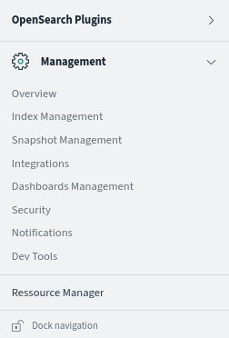
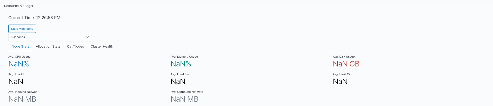
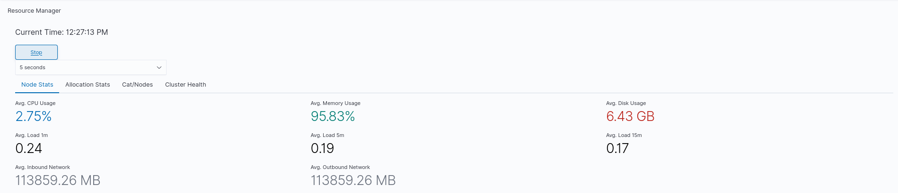
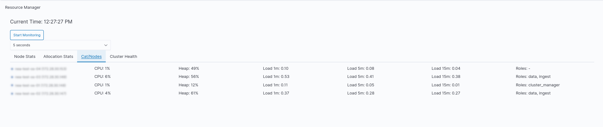

# Resource Manager for OpenSearch Dashboards

## Overview

The **Resource Manager** is a custom plugin for **OpenSearch Dashboards** designed to add a navigation option to set live resource monitoring.

## Features









## Installation

1. sudo bin/opensearch-dashboards-plugin install https://github.com/geoloe/resource_manager/raw/refs/heads/main/build/resourceManager-2.18.0.0.zip
2. Restart opensearch-dashboards.service

## Usage

Once the plugin is installed and OpenSearch Dashboards is running, the **Resource Manager** will automatically be active. Navigate to Resource Manager on the sidebar. The plugin operates by using the server backend to fetch information live.

## Security

The navigation menu will only be available to all users that have the all_access attached to it. So that only admins can use it.

If you wish to change this just change it here in the public plugin.tsx file and recompile the .zip.

```jsx
roles.includes('all_access')
```

For role access changes, you can adapt this part. Depending on your needs:

```jsx
    // Function to check if the user has the 'all_access' role
    const hasAllAccessRole = async (): Promise<boolean> => {
      return core.http
        .get('/api/cluster_resource_monitor/user_roles')
        .then((response: any) => {
          const roles = response.roles || [];
          return roles.includes('all_access'); // Check if 'all_access' role is present
        })
        .catch(() => false); // Handle errors gracefully
    };

    // Check if the user has the required role
    const hasAccess = await hasAllAccessRole();

    if (hasAccess) {
      // Register the application in the side navigation menu
      core.application.register({
        id: 'resourceManager',
        title: PLUGIN_NAME,
        async mount(params: AppMountParameters) {
          // Get start services as specified in opensearch_dashboards.json
          const [coreStart, depsStart] = await core.getStartServices();

          // Render the application
          const unmount = renderApp(coreStart, depsStart as AppPluginStartDependencies, params);

          // Return a cleanup function (AppUnmount) to be called when the app is unmounted
          return () => {
            unmount(); // Call any unmount logic from renderApp if it's provided
          };
        },
      });
    }
```

## Development

To modify and test the plugin locally:

1. Run OpenSearch Dashboards in development mode.
2. Make changes to the plugin code.
3. Reload OpenSearch Dashboards to see the changes in effect.

### Running Locally
- To run the OpenSearch Dashboards instance locally, use the following command:
  ```bash
  yarn start
  ```

## Contributing

Feel free to fork the repository, make changes, and create pull requests.

## License

This plugin is licensed under the [Apache 2.0 License](LICENSE).